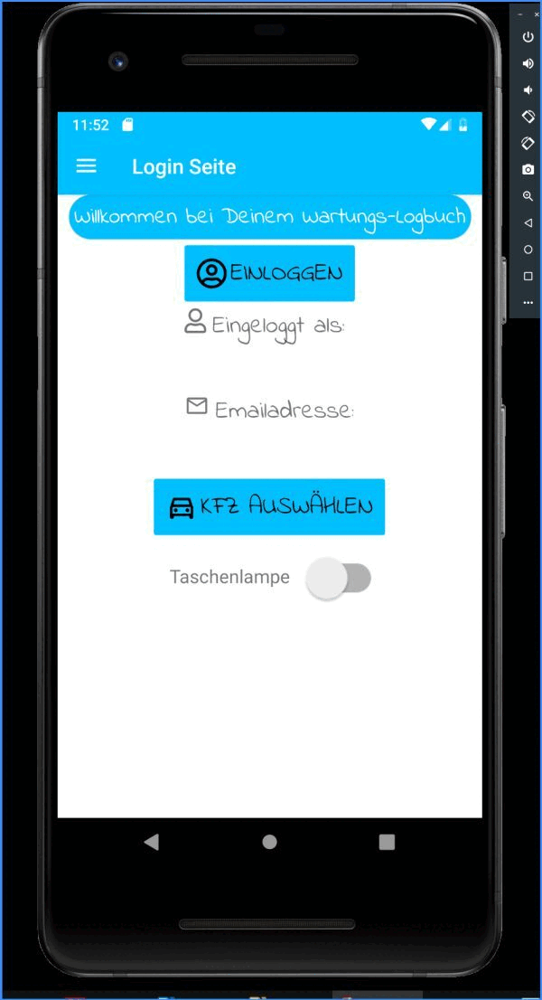

# simple Xamarin App connecting to Azure B2C and WebAPI with CosmosDB
## animated gif

## screenshots

- PDF step by step Documentation to setup Azure Backend: [Docu.pdf](Documentation_WartungsLOG.pdf)

